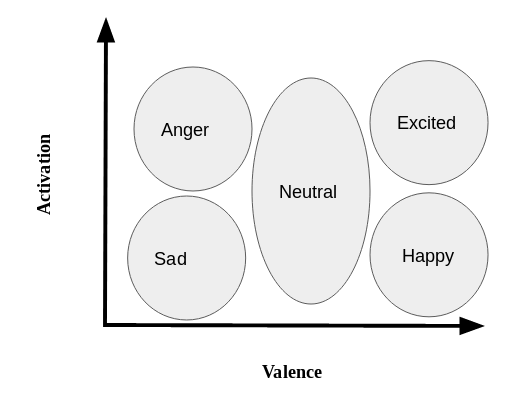

# IEMOCAP_Mutual_Emotion
This repository shows the step by step way to model the mutual influence in emotion from scratch. The project is still __in progress__

## Step 1:

Extract the utterance name, transcript, valence, activation, gender and dialog-id from the raw transcripts of the dataset. 

## Step 2:

Create the turns from the utterance. The turn can be defined as ``` utterances of a same speaker where almost no interruption occurred```. We make the averge of valence and activation value of such utterances to produce the valence and activation of the turns. 

## Step 3:

To define and label emotion, we use two dimensional approach from valence and activation. The  explains the process. 

## Step 4:

We use a Markov chain to build transition matrix from one person's emotional state to the other. 

## Step 5 (TBD)

We will create a hidden-markov-model to model the emotional dependency.
